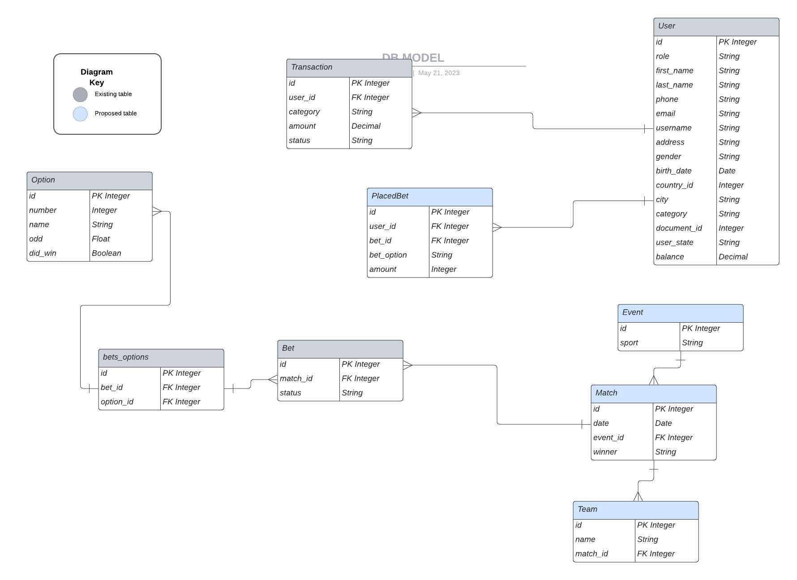

# PlayGreen Backend Developer Test

REST API that implements a betting system and performs automatic payments for winning bets.

### Requirements

Node version: 18.12.1
 
NPM version: 9.5.1

### How to set up

1. Install packages: `npm install`
2. Set required [environment variables](#environment-variables) in .env file
3. Make sure redis-server is running
4. Run `npm run dev`

### How to test

1. Make sure redis-server is running
2. Run `npm test`

### Dependencies

- TypeScript
- TypeORM
- MySQL
- Hapi
- Hapi Lab
- Joi
- Hapi JWT
- Hapi Basic
- Redis

### Environment Variables

- ACCESS_TOKEN_SECRET: Your secret for JWT generation
- DB_HOST: DB host
- DB_USERNAME: DB username
- DB_PASSWORD: DB password
- DATABASE: DB name
- ENVIRONMENT: Environment type, example "development"

### Final DB Model

